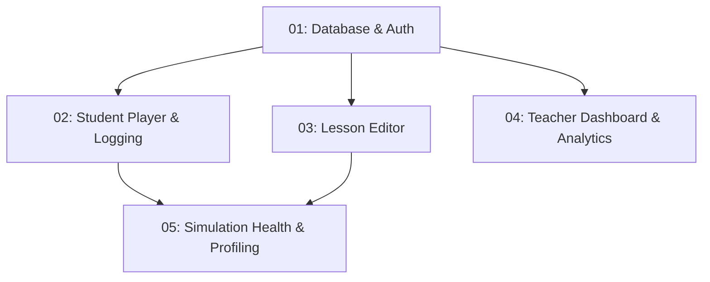

# Pocket Mice: Feature Selection Matrix

This document helps you select the specific features you want to generate or modify in the Pocket Mice simulations, lessons, and analytics platform. 

Based on your selection, follow the corresponding prompt files in the specified order.

---

## 📋 Feature Selection Checklist

Select the components you want to build by checking the boxes below:

### 1. 🗄️ Core Infrastructure
- [ ] **Auth & User Profiles**: User registration, authentication, profiles (admin/teacher roles).
- [ ] **Lesson Storage**: Storing and retrieving lesson metadata and nested JSON structures.
- [ ] **Live Sessions**: Creating active sessions for lessons, with short room codes.
- [ ] **Guest Students**: Registering students joining by code without full auth.
- *Requires:* [`01_database_and_auth_prompt.md`](file:///Users/rohanjhunja/Documents/LearnTube/Antigravity/pocket-mice/prompts/01_database_and_auth_prompt.md)

### 2. 🎮 Lesson Player & Student Experience
- [ ] **Linear Step Player**: Displaying lesson pages one-by-one, tracking progress.
- [ ] **Context/Response Steps**: Rendering text context pages and form input responses.
- [ ] **Simulation Embeds**: Displaying interactive content/HTML simulations in responsive iframe containers.
- [ ] **Embed Safeguards**: Fallbacks to direct links if iframe embeds are blocked by CSP headers.
- [ ] **Telemetry Logger**: Capturing student responses and navigation events (e.g., started, submitted).
- *Requires:* [`01_database_and_auth_prompt.md`](file:///Users/rohanjhunja/Documents/LearnTube/Antigravity/pocket-mice/prompts/01_database_and_auth_prompt.md) + [`02_student_player_and_logging_prompt.md`](file:///Users/rohanjhunja/Documents/LearnTube/Antigravity/pocket-mice/prompts/02_student_player_and_logging_prompt.md)

### 3. 📝 Lesson Editor (Teacher Tooling)
- [ ] **Visual Builder**: Nested editing of Lesson Info, Activities, and Steps.
- [ ] **Step Configurator**: Adding media blocks, prompts, and dropdown/multiple-choice option lists.
- [ ] **Simulation Uploader**: Uploading standalone HTML files directly into storage and embedding them.
- *Requires:* [`01_database_and_auth_prompt.md`](file:///Users/rohanjhunja/Documents/LearnTube/Antigravity/pocket-mice/prompts/01_database_and_auth_prompt.md) + [`03_lesson_editor_prompt.md`](file:///Users/rohanjhunja/Documents/LearnTube/Antigravity/pocket-mice/prompts/03_lesson_editor_prompt.md)

### 4. 📊 Teacher Dashboard & Session Management
- [ ] **Teacher Library**: List, search, bookmark, and duplicate lessons.
- [ ] **Launch Configurator**: Dialog to pick/filter specific steps/activities before launching.
- [ ] **Session List**: Track past sessions and active session codes.
- [ ] **Live Analytics**: Live dashboard showing student progress, completion rate, step response distributions.
- *Requires:* [`01_database_and_auth_prompt.md`](file:///Users/rohanjhunja/Documents/LearnTube/Antigravity/pocket-mice/prompts/01_database_and_auth_prompt.md) + [`04_teacher_dashboard_and_analytics_prompt.md`](file:///Users/rohanjhunja/Documents/LearnTube/Antigravity/pocket-mice/prompts/04_teacher_dashboard_and_analytics_prompt.md)

### 5. 🏥 Simulation Health Monitoring & Profiling (Admin/Advanced Tooling)
- [ ] **Baseline Profiler**: Backfill profiling script that measures TTFB and size to establish ideal load times.
- [ ] **Performance Telemetry**: Student client reporting of dynamic iframe load time and timeout statuses.
- [ ] **Diagnostics Engine**: Diagnostic analysis identifying if lag/error is due to device, network, or server origin.
- [ ] **Admin Health Monitor**: Aggregate dashboard listing status (Healthy/Degraded/Unhealthy) of all simulations.
- *Requires:* All prompts: [`01`](file:///Users/rohanjhunja/Documents/LearnTube/Antigravity/pocket-mice/prompts/01_database_and_auth_prompt.md), [`02`](file:///Users/rohanjhunja/Documents/LearnTube/Antigravity/pocket-mice/prompts/02_student_player_and_logging_prompt.md), and [`05_sim_health_monitoring_prompt.md`](file:///Users/rohanjhunja/Documents/LearnTube/Antigravity/pocket-mice/prompts/05_sim_health_monitoring_prompt.md).

---

## 🛠️ Combined Setup Pathways

Depending on your use case, here is the recommended generation sequence:

### Pathway A: Minimal Player (Just run a structured lesson)
1. Run [`01_database_and_auth_prompt.md`](file:///Users/rohanjhunja/Documents/LearnTube/Antigravity/pocket-mice/prompts/01_database_and_auth_prompt.md)
2. Run [`02_student_player_and_logging_prompt.md`](file:///Users/rohanjhunja/Documents/LearnTube/Antigravity/pocket-mice/prompts/02_student_player_and_logging_prompt.md)

### Pathway B: Teacher Platform (Create lessons, launch sessions, and view student responses)
1. Run [`01_database_and_auth_prompt.md`](file:///Users/rohanjhunja/Documents/LearnTube/Antigravity/pocket-mice/prompts/01_database_and_auth_prompt.md)
2. Run [`02_student_player_and_logging_prompt.md`](file:///Users/rohanjhunja/Documents/LearnTube/Antigravity/pocket-mice/prompts/02_student_player_and_logging_prompt.md)
3. Run [`03_lesson_editor_prompt.md`](file:///Users/rohanjhunja/Documents/LearnTube/Antigravity/pocket-mice/prompts/03_lesson_editor_prompt.md)
4. Run [`04_teacher_dashboard_and_analytics_prompt.md`](file:///Users/rohanjhunja/Documents/LearnTube/Antigravity/pocket-mice/prompts/04_teacher_dashboard_and_analytics_prompt.md)

### Pathway C: Full Production Suite (All the above + simulation performance monitoring telemetry)
1. Run all prompts in order: `01` ➡️ `02` ➡️ `03` ➡️ `04` ➡️ `05`.
